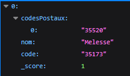

commande Curl pour récupérer le code postal d'une commune :

```Curl
Curl 'https://geo.api.gouv.fr/communes?nom=melesse&fields=codesPostaux'
```
Liens de l'API : https://geo.api.gouv.fr/decoupage-administratif/communes
Retour : 

